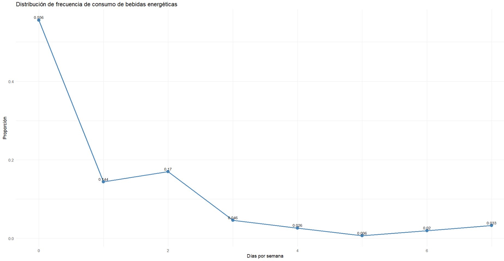
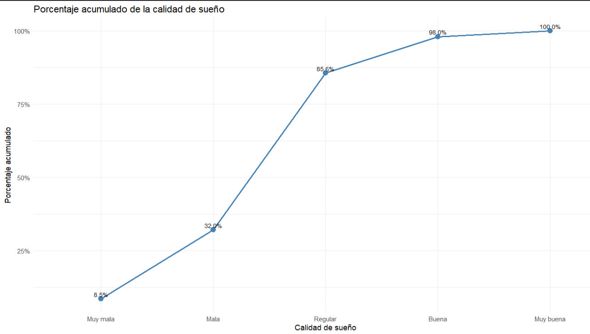
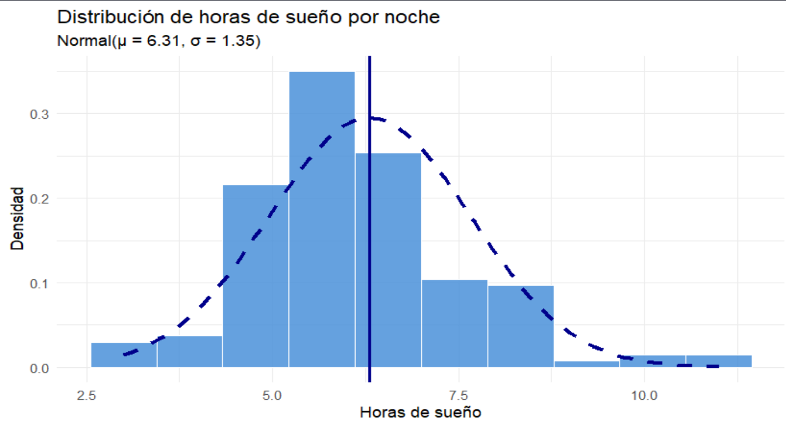
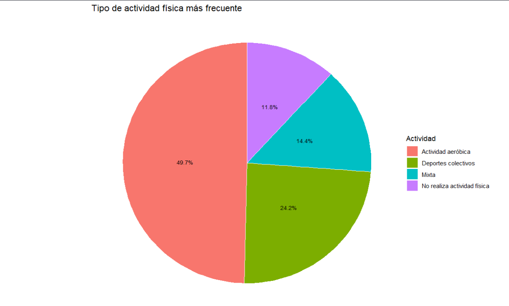
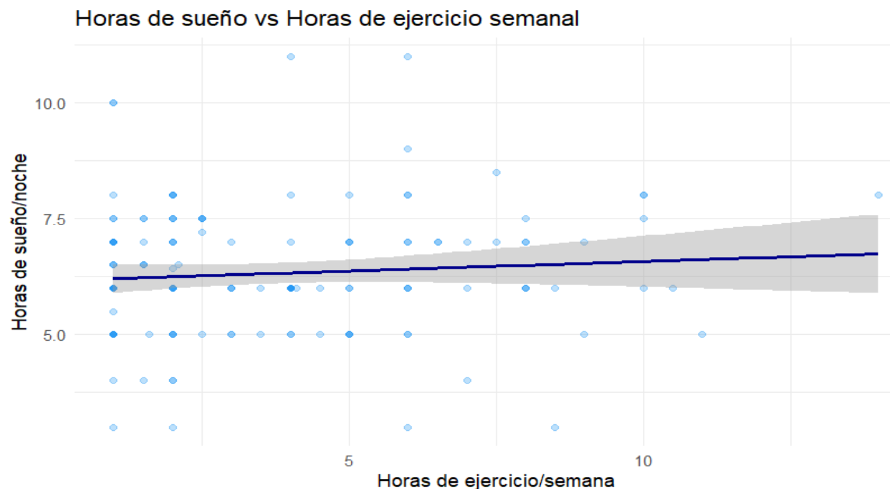
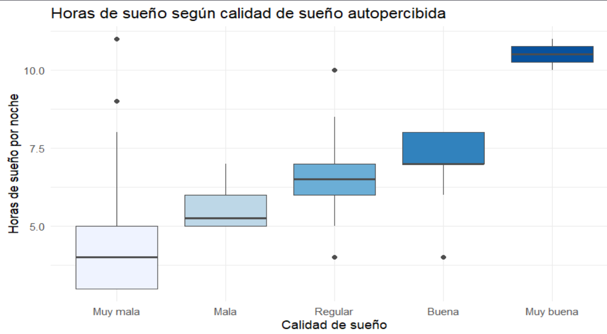
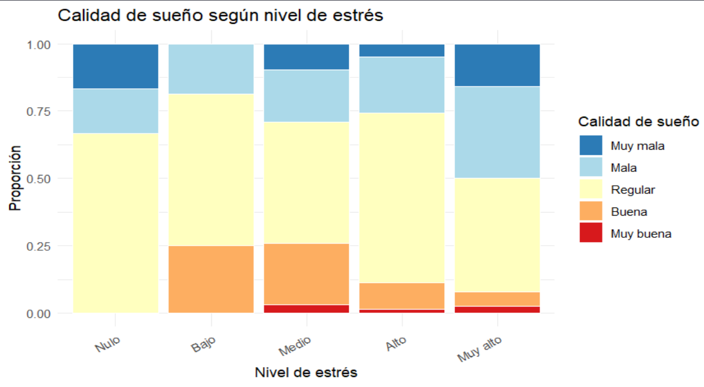

```{r setup, include=FALSE}
if (!require(ggplot2))  install.packages("ggplot2")
if (!require(dplyr))    install.packages("dplyr")
if (!require(readr))    install.packages("readr")
if (!require(moments))  install.packages("moments")
if (!require(knitr))    install.packages("knitr")

library(ggplot2)
library(dplyr)
library(readr)
library(moments)
library(knitr)

DF <- read_csv("Encuesta.csv", show_col_types = FALSE)

niveles_cs <- c("Muy mala", "Mala", "Regular", "Buena", "Muy buena")

DF <- DF %>% mutate(
  Edad            = as.integer(Edad),
  CantidadCursos  = as.integer(CantidadCursos),
  FrecBebida      = as.integer(FrecBebida),
  UnidadBebida    = as.integer(UnidadBebida),
  Sexo            = factor(Sexo),
  Carrera         = factor(Carrera),
  ActividadFisica = factor(ActividadFisica),
  CanDesayuno     = factor(CanDesayuno,
                           levels = c("Ninguna","Poca","Regular","Bastante","Mucha"),
                           ordered = TRUE),
  CalidadSuenio   = factor(CalidadSuenio, levels = niveles_cs, ordered = TRUE),
  Estres          = factor(Estres,
                           levels = c("Nulo","Bajo","Medio","Alto","Muy alto"),
                           ordered = TRUE),
  CicloAcademico  = factor(as.integer(CicloAcademico), levels = 1:10, ordered = TRUE)
)

DF_seccion <- DF
n_seccion  <- nrow(DF_seccion)

n_fb         <- sum(!is.na(DF_seccion$FrecBebida))
p_consume    <- sum(DF_seccion$FrecBebida > 0, na.rm = TRUE) / n_fb

n_cs         <- sum(!is.na(DF_seccion$CalidadSuenio))
p_mal_suenio <- sum(as.character(DF_seccion$CalidadSuenio) %in%
                      c("Muy mala", "Mala"), na.rm = TRUE) / n_cs

v1_tabla <- DF_seccion %>%
  filter(!is.na(FrecBebida)) %>%
  count(FrecBebida) %>%
  arrange(FrecBebida) %>%
  mutate(P = round(n / sum(n), 4))

v2_tabla <- DF_seccion %>%
  filter(!is.na(CalidadSuenio)) %>%
  mutate(CalidadSuenio = factor(as.character(CalidadSuenio), levels = niveles_cs)) %>%
  count(CalidadSuenio) %>%
  arrange(CalidadSuenio) %>%
  mutate(P = round(n / sum(n), 4))

ejercicio_vec <- DF_seccion$HorasEjercicio[!is.na(DF_seccion$HorasEjercicio)]
suenio_vec    <- DF_seccion$HorasSuenio[!is.na(DF_seccion$HorasSuenio)]

mu_ej  <- mean(ejercicio_vec);  sd_ej  <- sd(ejercicio_vec);  lam_ej <- 1 / mu_ej
mu_su  <- mean(suenio_vec);     sd_su  <- sd(suenio_vec)
```

## Antecedentes

**Relevancia**: El estilo de vida de los estudiantes universitarios y de institutos se encuentra estrechamente relacionado con factores que afectan su salud física y mental como el consumo de bebidas energéticas, la cual aumenta consirablemente por las exigencias académicas, provocando alteraciones en los hábitos de sueño y afectando el bienestar estudiantil.

**Justificación**: El análisis de la relación entre el consumo de bebidas energéticas y el bienestar estudiantil es relevante para identificar patrones que permitan orientar estrategias de salud en la comunidad académica.

{width="70%" fig-align="center"}

## Objetivos

**Objetivo general**:

- Analizar la relación entre el consumo de bebidas energéticas y los hábitos de sueño, actividad física y bienestar general de estudiantes universitarios y de institutos durante el ciclo académico 2026-I mediante herramientas de análisis estadístico y probabilístico.

**Objetivos específicos**

- Determinar la relación entre la frecuencia de consumo de bebidas energéticas y las horas de sueño diarias de los estudiantes durante el ciclo académico 2026-I.

- Analizar la relación entre el nivel de estrés autopercibido y la calidad de sueño reportada por los estudiantes durante el ciclo académico 2026-I.

## Datos y Limpieza de Datos

- Datos obtenidos mediante una encuesta hacia estudiantes universitarios y de institutos.

- Muestreo no probabilístico por conveniencia

- Limpieza: validación de rangos (ej. Edad ∈ \[17,25\], HorasSuenio ∈ \[3,12\]), normalización de categorías textuales, eliminación de registros sin edad, sexo o carrera.

- Variables renombradas de preguntas largas a nombres cortos.

## Variables

| Variable        | Tipo                  | Restricción           |
|-----------------|-----------------------|-----------------------|
| Edad            | Cuantitativa discreta | \[17, 25\] años       |
| Sexo            | Cualitativa nominal   | Masculino / Femenino  |
| HorasSuenio     | Cuantitativa continua | \[3, 12\] horas       |
| HorasEjercicio  | Cuantitativa continua | \[0, 20\] horas       |
| FrecBebida      | Cuantitativa discreta | \[0, 7\] días/semana  |
| UnidadBebida    | Cuantitativa discreta | \[0, 5\] unidades/día |
| CalidadSuenio   | Cualitativa ordinal   | Muy mala → Muy buena  |
| Estres          | Cualitativa ordinal   | Nulo → Muy alto       |
| ActividadFisica | Cualitativa nominal   | 5 categorías          |
| Carrera         | Cualitativa nominal   | 6 áreas               |
| CantidadCursos  | Cuantitativa discreta | \[3, 8\] cursos       |
| CicloAcademico  | Cualitativa ordinal   | \[1, 10\]             |
| CanDesayuno     | Cualitativa ordinal   | Ninguna → Mucha       |

## Análisis Univariado

::::: columns
::: {.column width="50%"}
{width="100%"}

{width="100%"}
:::

::: {.column width="50%"}
{width="100%"}

{width="100%"}
:::
:::::

## Análisis Bivariado

::::: columns
::: {.column width="34%"}
{width="100%"}

{width="100%"}
:::

::: {.column width="66%"}
{width="100%"}
:::
:::::

## Probabilidad Empírica

::::: columns
::: {.column width="50%"}
**Variable 1 — FrecBebida**

$EA_1$: seleccionar una persona al azar y observar cuántos días por semana consume bebidas energéticas.

$$\Omega_{EA_1} = \{0,1,2,3,4,5,6,7\}$$

```{r echo=FALSE}
kable(v1_tabla %>% rename(`Días/semana` = FrecBebida, Frecuencia = n, `P(Eᵢ)` = P))
```

```{r echo=FALSE, message=FALSE, warning=FALSE, fig.height=3}
ggplot(v1_tabla, aes(x = factor(FrecBebida), y = P, fill = factor(FrecBebida))) +
  geom_bar(stat = "identity", color = "white", width = 0.7) +
  geom_text(aes(label = round(P,3)), vjust = -0.5, size = 3) +
  labs(title = "Probabilidad empírica — FrecBebida",
       x = "Días por semana", y = "P(Eᵢ)") +
  theme_minimal() + theme(legend.position = "none")
```

```{r echo=FALSE}
n_v1 <- sum(!is.na(DF_seccion$FrecBebida))
P_E1_v1 <- sum(DF_seccion$FrecBebida == 0, na.rm=TRUE) / n_v1
P_E8_v1 <- sum(DF_seccion$FrecBebida == 7, na.rm=TRUE) / n_v1
cat("P(0 días) =", round(P_E1_v1,4),
    "| P(7 días) =", round(P_E8_v1,4),
    "| Suma =", round(sum(v1_tabla$P),4), "\n")
```

→ **P(E₁) = `r round(P_E1_v1,3)`** (no consume). Distribución decrece conforme aumenta la frecuencia; consumo diario es el menos probable (**P(E₈) = `r round(P_E8_v1,3)`**).
:::

::: {.column width="50%"}
**Variable 2 — CalidadSuenio**

$EA_2$: seleccionar una persona al azar y observar su calidad de sueño autopercibida.

$$\Omega_{EA_2} = \{\text{Muy mala},\ \text{Mala},\ \text{Regular},\ \text{Buena},\ \text{Muy buena}\}$$

```{r echo=FALSE}
kable(v2_tabla %>% rename(Categoría = CalidadSuenio, Frecuencia = n, `P(Eᵢ)` = P))
```

```{r echo=FALSE, message=FALSE, warning=FALSE, fig.height=3}
ggplot(v2_tabla, aes(x = CalidadSuenio, y = P, fill = CalidadSuenio)) +
  geom_bar(stat = "identity", color = "white", width = 0.7) +
  geom_text(aes(label = round(P,3)), vjust = -0.5, size = 3) +
  scale_fill_brewer(palette = "Blues") +
  labs(title = "Probabilidad empírica — CalidadSuenio",
       x = "Calidad de sueño", y = "P(Eᵢ)") +
  theme_minimal() +
  theme(legend.position = "none",
        axis.text.x = element_text(angle = 20, hjust = 1))
```

```{r echo=FALSE}
cs <- as.character(DF_seccion$CalidadSuenio)
n_v2  <- sum(!is.na(cs))
P_reg <- sum(cs == "Regular",  na.rm=TRUE) / n_v2
P_def <- sum(cs %in% c("Muy mala","Mala"), na.rm=TRUE) / n_v2
cat("P(Regular) =", round(P_reg,4),
    "| P(Mala o Muy mala) =", round(P_def,4), "\n")
```

→ Regular concentra **≈`r round(P_reg*100,1)`%** de las observaciones. Sueño deficiente (Mala o Muy mala) = **`r round(P_def,3)`**.
:::
:::::

## Probabilidad Condicional

**Eventos:** $E_1$ = no consume bebidas energéticas (FrecBebida = 0) · $E_2$ = sueño **Regular, Mala o Muy mala**

**Definición formal de independencia:** dos eventos $A$ y $B$ son independientes si y solo si $$P(A \cap B) = P(A) \cdot P(B)$$ De lo contrario, son **dependientes**.

```{r echo=FALSE}
DF_cond <- DF_seccion %>%
  filter(!is.na(FrecBebida), !is.na(CalidadSuenio)) %>%
  mutate(
    E1 = ifelse(FrecBebida == 0, "No consume", "Consume"),
    E2 = ifelse(as.character(CalidadSuenio) %in% c("Muy mala","Mala","Regular"),
                "Sueño regular o peor", "Sueño bueno o muy bueno")
  )

n_cond <- nrow(DF_cond)
P_E1   <- sum(DF_cond$E1 == "No consume") / n_cond
P_E2   <- sum(DF_cond$E2 == "Sueño regular o peor") / n_cond
P_int  <- sum(DF_cond$E1 == "No consume" & DF_cond$E2 == "Sueño regular o peor") / n_cond
P_E2c  <- 1 - P_E2
P_E1_E2  <- P_int / P_E2
P_E2_E1  <- P_int / P_E1
P_E1_E2c <- sum(DF_cond$E1=="No consume" & DF_cond$E2=="Sueño bueno o muy bueno") /
             sum(DF_cond$E2=="Sueño bueno o muy bueno")
```

::::: columns
::: {.column width="55%"}
```{r echo=FALSE}
cat("P(E1) =", round(P_E1,4), "| P(E2) =", round(P_E2,4), "\n")
cat("P(E1 ∩ E2) =", round(P_int,4),
    "| P(E1)·P(E2) =", round(P_E1*P_E2,4), "\n")
cat("P(E1|E2) =", round(P_E1_E2,4),
    "| P(E2|E1) =", round(P_E2_E1,4), "\n")
if (round(P_int,4) != round(P_E1*P_E2,4))
  cat("Los eventos son DEPENDIENTES\n")

Bayes <- (P_E1_E2 * P_E2) / ((P_E1_E2 * P_E2) + (P_E1_E2c * P_E2c))
cat("T. Bayes P(E2|E1) =", round(Bayes,4))
if (round(Bayes,4) == round(P_E2_E1,4)) cat(" ✓ Verificado\n")
```

**Conclusión:** como $P(E_1 \cap E_2) = `r round(P_int,4)` \neq P(E_1)\cdot P(E_2) = `r round(P_E1*P_E2,4)`$, los eventos son **DEPENDIENTES**. El **`r round(P_E2_E1*100,1)`%** de quienes no consumen reporta sueño Regular o peor, ligeramente superior a la marginal `r round(P_E2*100,1)`%. Evitar el consumo no garantiza mejor sueño — otros factores como el estrés influyen más. Bayes verifica el resultado ✓.
:::

::: {.column width="45%"}
```{r echo=FALSE, message=FALSE, warning=FALSE, fig.height=4}
DF_cond %>%
  count(E1, E2) %>%
  group_by(E1) %>%
  mutate(prop = n / sum(n)) %>%
  ungroup() %>%
  ggplot(aes(x = E1, y = prop, fill = E2)) +
  geom_bar(stat = "identity", color = "white", width = 0.65) +
  geom_text(aes(label = paste0(round(prop*100,1), "%")),
            position = position_stack(vjust = 0.5),
            color = "white", size = 4, fontface = "bold") +
  scale_fill_manual(values = c("Sueño regular o peor" = "#C0392B",
                                "Sueño bueno o muy bueno" = "#27AE60")) +
  labs(title = expression(paste("P(", E[2], " | ", E[1], ")")),
       subtitle = "Si fueran independientes, ambas barras serían iguales",
       x = "Grupo (E₁)", y = "Proporción") +
  theme_minimal() +
  theme(legend.position = "bottom",
        legend.title = element_blank(),
        legend.text = element_text(size = 7),
        plot.subtitle = element_text(size = 8, face = "italic"))
```
:::
:::::

## Variables Aleatorias Discretas

::::::: columns
:::: {.column width="50%"}
**Geométrica — FrecBebida**

$$X \sim \text{Geom}(p) \quad ; \quad P(X=k) = (1-p)^{k-1}\,p$$

Nº de estudiantes seleccionados hasta el primer consumidor.

::: {style="font-size: 0.75em;"}
**¿Por qué Geom?**

- Cada estudiante es un ensayo independiente con dos resultados (consume / no consume).
- Probabilidad $p$ constante en cada ensayo.
- Se cuenta el nº de ensayos hasta el **primer éxito**.
- Soporte: $X \in \{1, 2, 3, \ldots\}$ (no acotado).
:::

```{r echo=FALSE}
cat("p =", round(p_consume,4), "\n")
E_X1 <- 1/p_consume; V_X1 <- (1-p_consume)/p_consume^2; SD_X1 <- sqrt(V_X1)
cat("E(X) =", round(E_X1,4), "| V(X) =", round(V_X1,4),
    "| SD(X) =", round(SD_X1,4),"\n")

k1 <- 3; P_X3 <- dgeom(k1-1, prob=p_consume)
lim1 <- 5; P_Xleq5 <- pgeom(lim1-1, prob=p_consume)
cat("P(X=3) =", round(P_X3,4), "| P(X≤5) =", round(P_Xleq5,4), "\n")
```

```{r echo=FALSE, message=FALSE, warning=FALSE, fig.height=2.8}
df_geom <- data.frame(x=1:15, pmf=dgeom(0:14,p_consume))
ggplot(df_geom, aes(x=factor(x), y=pmf)) +
  geom_bar(stat="identity", fill="#2196F3", color="white", width=0.7) +
  geom_text(aes(label=round(pmf,3)), vjust=-0.4, size=2.3) +
  labs(title=paste0("PMF — Geom(p = ", round(p_consume,4), ")"),
       x="k", y="P(X=k)") +
  theme_minimal()
```

→ Bastan **`r round(E_X1,1)` estudiantes** en promedio; en el `r round(P_Xleq5*100,0)`% de casos aparece dentro de 5 intentos.
::::

:::: {.column width="50%"}
**Binomial — CalidadSuenio**

$$Y \sim \text{Bin}(n,p) \quad ; \quad P(Y=k) = \binom{n}{k} p^k (1-p)^{n-k}$$

Nº con sueño deficiente en un grupo de $n=10$ estudiantes.

::: {style="font-size: 0.75em;"}
**¿Por qué Binomial?**

- Nº fijo de ensayos: $n = 10$ estudiantes.
- Cada ensayo es éxito/fracaso (sueño deficiente / no deficiente).
- Probabilidad $p$ constante (mismo nivel de la encuesta).
- Ensayos asumidos independientes.
- Soporte: $Y \in \{0, 1, 2, \ldots, 10\}$ (acotado por $n$).
:::

```{r echo=FALSE}
cat("p =", round(p_mal_suenio,4), "\n")
n_b <- 10
E_Y <- n_b*p_mal_suenio; V_Y <- n_b*p_mal_suenio*(1-p_mal_suenio); SD_Y <- sqrt(V_Y)
cat("E(Y) =", round(E_Y,4), "| V(Y) =", round(V_Y,4),
    "| SD(Y) =", round(SD_Y,4),"\n")

k2 <- 2; P_Y2 <- dbinom(k2,n_b,p_mal_suenio)
lim2 <- 3; P_Yleq3 <- pbinom(lim2,n_b,p_mal_suenio)
cat("P(Y=2) =", round(P_Y2,4), "| P(Y≤3) =", round(P_Yleq3,4), "\n")
```

```{r echo=FALSE, message=FALSE, warning=FALSE, fig.height=2.8}
df_binom <- data.frame(y=0:10, pmf=dbinom(0:10,n_b,p_mal_suenio))
ggplot(df_binom, aes(x=factor(y), y=pmf)) +
  geom_bar(stat="identity", fill="#9C27B0", color="white", width=0.7) +
  geom_text(aes(label=round(pmf,3)), vjust=-0.4, size=2.3) +
  labs(title=paste0("PMF — Bin(10, p = ", round(p_mal_suenio,4), ")"),
       x="k", y="P(Y=k)") +
  theme_minimal()
```

→ Se esperan **`r round(E_Y,2)` estudiantes** deficientes por grupo de 10; en el `r round(P_Yleq3*100,0)`% de grupos habrá a lo mucho 3.
::::
:::::::

## Variables Aleatorias Continuas

::::::: columns
:::: {.column width="50%"}
**Exponencial — HorasEjercicio**

$$Z \sim \text{Exp}(\lambda) \quad ; \quad f(z) = \lambda e^{-\lambda z}$$

::: {style="font-size: 0.75em;"}
**¿Por qué Exponencial?**

- Variable continua positiva ($Z \geq 0$).
- Asimetría = **`r round(skewness(ejercicio_vec),2)`** (cola derecha pronunciada).
- Curtosis = **`r round(kurtosis(ejercicio_vec),2)`**, incompatible con Normal.
- Media ≈ SD, propio de Exp ($E(Z) = SD(Z) = 1/\lambda$).
- Soporte: $Z \in [0, \infty)$.
:::

```{r echo=FALSE}
cat("n =", length(ejercicio_vec),
    "| Media =", round(mu_ej,4),
    "| SD =", round(sd_ej,4),
    "\nλ =", round(lam_ej,4),
    "| E(Z) = 1/λ =", round(1/lam_ej,4),
    "| V(Z) = 1/λ² =", round(1/lam_ej^2,4), "\n")
```

```{r echo=FALSE, message=FALSE, warning=FALSE, fig.height=2.7}
ggplot(data.frame(x=ejercicio_vec), aes(x=x)) +
  geom_histogram(aes(y=after_stat(density)), bins=15,
                 fill="#E76F51", color="white", alpha=0.85) +
  stat_function(fun=dexp, args=list(rate=lam_ej),
                color="red", linewidth=1.2, linetype="dashed") +
  geom_vline(xintercept=mu_ej, color="red", linewidth=1) +
  labs(title="Distribución de HorasEjercicio",
       subtitle=paste0("Exp(λ = ",round(lam_ej,4),")"),
       x="Horas/semana", y="Densidad") +
  theme_minimal()
```

```{r echo=FALSE}
P_Z5 <- 1 - pexp(5, rate=lam_ej)
cat("P(Z > 5) =", round(P_Z5,4),
    "→", round(P_Z5*100,1), "% > 5 hrs/semana\n")
```

→ **`r round((1-P_Z5)*100,1)`%** realiza 5 hrs o menos.
::::

:::: {.column width="50%"}
**Normal — HorasSuenio**

$$W \sim N(\mu, \sigma^2) \quad ; \quad f(w) = \tfrac{1}{\sigma\sqrt{2\pi}} e^{-\tfrac{(w-\mu)^2}{2\sigma^2}}$$

::: {style="font-size: 0.75em;"}
**¿Por qué Normal?**

- Variable continua simétrica alrededor de su media.
- Asimetría = **`r round(skewness(suenio_vec),2)`** (≈ 0, simétrica).
- Curtosis = **`r round(kurtosis(suenio_vec),2)`** (≈ 3, mesocúrtica).
- Histograma con forma de campana centrada en μ.
- Soporte: $W \in (-\infty, \infty)$ (en práctica acotado por la fisiología).
:::

```{r echo=FALSE}
cat("n =", length(suenio_vec),
    "| μ =", round(mu_su,4),
    "| σ =", round(sd_su,4),
    "\nE(W) = μ =", round(mu_su,4),
    "| V(W) = σ² =", round(sd_su^2,4), "\n")
```

```{r echo=FALSE, message=FALSE, warning=FALSE, fig.height=2.7}
ggplot(data.frame(x=suenio_vec), aes(x=x)) +
  geom_histogram(aes(y=after_stat(density)), bins=10,
                 fill="#4A90D9", color="white", alpha=0.85) +
  stat_function(fun=dnorm, args=list(mean=mu_su, sd=sd_su),
                color="darkblue", linewidth=1.2, linetype="dashed") +
  geom_vline(xintercept=mu_su, color="darkblue", linewidth=1) +
  labs(title="Distribución de HorasSuenio",
       subtitle=paste0("Normal(μ = ",round(mu_su,2),", σ = ",round(sd_su,2),")"),
       x="Horas/noche", y="Densidad") +
  theme_minimal()
```

```{r echo=FALSE}
P_rango <- pnorm(8,mu_su,sd_su) - pnorm(6,mu_su,sd_su)
cat("P(6 ≤ W ≤ 8) =", round(P_rango,4),
    "→", round(P_rango*100,1), "% duerme 6-8 hrs\n")
```

→ **`r round(P_rango*100,1)`%** duerme en el rango recomendado (6-8 hrs).
::::
:::::::

## Conclusiones

El análisis reveló que más de la mitad de los estudiantes (**`r round(P_E1*100,1)`%**) no consume bebidas energéticas, aunque los que sí lo hacen muestran mayor frecuencia de sueño deficiente, confirmada por la dependencia estadística entre ambos eventos ($P(E_1 \cap E_2) \neq P(E_1) \cdot P(E_2)$). Los estudiantes duermen en promedio **`r round(mu_su,1)` horas** por noche, con el **`r round(P_rango*100,1)`%** dentro del rango recomendado de 6–8 horas; la distribución Normal es un buen modelo para esta variable. El ejercicio físico, en cambio, sigue una distribución Exponencial con la mayoría concentrada en valores bajos (**`r round((1-P_Z5)*100,1)`%** realiza 5 horas o menos por semana). La relación entre nivel de estrés y calidad de sueño sugiere que intervenciones en manejo del estrés podrían mejorar el bienestar estudiantil.
